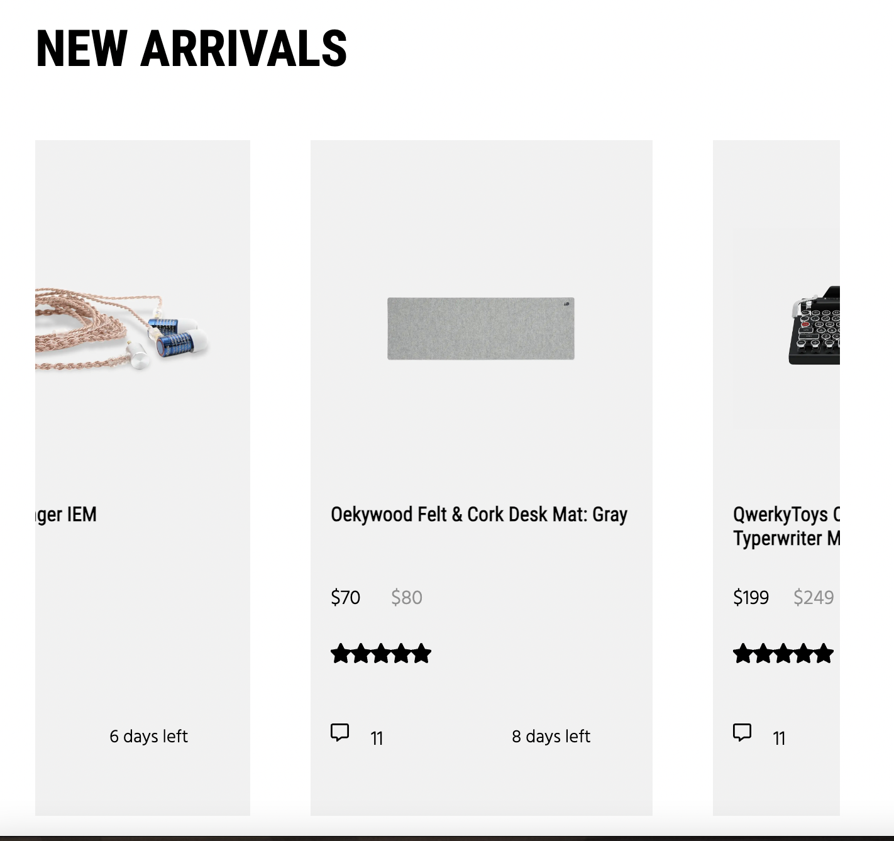

# Procesverslag
Markdown is een simpele manier om HTML te schrijven.  
Markdown cheat cheet: [Hulp bij het schrijven van Markdown](https://github.com/adam-p/markdown-here/wiki/Markdown-Cheatsheet).

Nb. De standaardstructuur en de spartaanse opmaak van de README.md zijn helemaal prima. Het gaat om de inhoud van je procesverslag. Besteedt de tijd voor pracht en praal aan je website.

Nb. Door *open* toe te voegen aan een *details* element kun je deze standaard open zetten. Fijn om dat steeds voor de relevante stuk(ken) te doen.

## Jij

  
uitwerken voor kick-off werkgroep

  ### Auteur:
  Jacco Mols

  #### Je startniveau:
  Rood

  #### Je focus:
  Responsive
 

## Je website

  
uitwerken voor kick-off werkgroep

  ### Je opdracht:
  https://drop.com/home / Een webshop waar je machenical keyboards,
headsets en andere associares kan kopen voor gaming. 

  #### Screenshot(s) van de eerste pagina (small screen): 
  Home page (https://drop.com/home)
  

  #### Screenshot(s) van de tweede pagina (small screen):
  Product Detail (https://drop.com/buy/shouer-singer-iem?searchId=524684c6c1d3a48b5a314a025089f478)
  
 

## Toegankelijkheidstest 1/2 (week 1)

  
uitwerken na test in 2e werkgroep

  ### Bevindingen
  Lijst met je bevindingen die in de test naar voren kwamen:

  - De originele site is helemaal niet semantisch ze hebben namelijk ongelofelijk veel divs, en totaal geen h1's. 
    Hierdoor is het dus lastiger om door site heen te navigeren met de screenreaders.

  - De screenreader werkt niet echt, omdat je niet makkelijk verder kan navigeren van je de navigatie. Hij noemt de elementen wel op maar herhaalt "Link" opgegeven moment waardoor je niet echt verder kan of waar je bent. Hij herkent soommige elementen ook als link die geen link zijn. 

  - De slideshow aan de bonvenkant kan niet gepauzeerd worden, waardoor die steeds door gaat tenzij je verder scrollt.

  
  
  
  
  

## Breakdownschets (week 1)

  
uitwerken na afloop 3e werkgroep

  ### de hele pagina: 
  

  ### dynamisch deel (bijv menu): 
  

  ### wellicht nog een dynamisch deel (bijv filter): 
  

  ### Stand van zaken
  In de eerste week was voornamelijk nog veel mee doen met oefeningen over grids en om over het algemeen op te warmen met code.
  Aan het eind van de week was ik begonnen met het maken van site en heb ik als eerst de naivgatie gemaakt. Omdat ik gewent ben om display flex te gebruiken, had ik dat hierbij gedaan. Hierdoor was het niet responsive wat uiteindelijk wel mijn doel was.
  Na wat tips van mijn medestudenten wist ik dat je het met een grid heel makkelijk responsive kan maken. Dit was eerst heel verwarrend, maar lukte uiteindelijk wel door wat dingen uit te proberen. 

  

  Verder ben ik de eerste week vooral bezig geweest met het maken van oefeningen om dat in mijn vingers te krijgen. En er klaar
  voor zijn om grid te gebruiken voor mijn website.

## Voortgang 1 (week 2)

  
uitwerken voor 1e voortgang

  ### Stand van zaken
  In de tweede week ben veel bezig geweest om een goed deel van mijn site te hebben zo ben ik 
  
  verder gegaan met het uitproberen van een grid bij “shop bij categorie” en na wat verbeteringen ging het veel beter. Dit deel was het alleen niet responsive, Ik had het aan een klasgenoot grevraagd die aan mij had uitgelegd dat het makkelijk op te lossen was door te zeggen “width: 100%”. Ik had hierna dus al 2 delen die responsive waren en een grid hadden waar ik heel blij mee was.
  

  Het bovente stuk oftewel de slideshow is het lastigeste volgensmij, omdat ik niet alleen elementen buiten andere elementen moet plaatsen, maar ook omdat ik er een animatie bij moet maken. 

  Het begin was heel lastig want ik had een blok tekst waarvan ik niet wist of dit beter met display flex of grid moest. Ik kwam er zelf niet uit dus ik had het aan een klasgenoot gevraagd, die mij had
  geholpen met een vlak tekst over een afbeelding plaatsen en verteld dat het beter is als ik een grid
  gebruik, omdat je dan makkelijk elementen op specifieke plekken kan zetten. 

  Waar ik nu mee vastloop is het plaatsen van de 2 kleinen knoppen en met wat uitleg van de docent snap ik het al beter, maar kom ik er nog steeds niet helemaal uit.
  

  Hierna had ik nog wat elementen in de article (blok tekst) aangepast zodat het er nog wat beter uit ziet.
  

## Voortgang 2 (week 3)

  
uitwerken voor 2e voortgang

  Voor de “build your own keyboard” sectie, ging het heel makkelijk. Ik had display flex gebruikt voor dit stuk omdat ik dacht dat makkelijker zou zijn dan een grid. Het ging daardoor wel makkelijk en snel, maar dit stuk is niet helemaal responsive, de tekst die schaalt niet mee, waardoor het helemaal uit elkaar breekt.

  
  Dit valt denk ik wel makkelijk op te lossen door media queries te gebruiken en de vormgeving een beetje veranderen door de tekst onder de afbeedling te zetten net zoals bij de originele website.

  Hierna had ik de ‘new arrivals’ gemaakt. Die heb ik gemaakt door een ul te maken voor elk product en elk product een grid te geven. Dit was veel gepuzzel en duurde even voordat het was gelukt, omdat de maten een beetje lastig waren te vinden voor de producten. Na feedback van de docent bleek het dat het beter was als ik i.p.v een hele boel ul’s maak kan ik ook 1 ul maken en dan elk product in zijn eigen li. Dit heb ik uiteindelijk niet gedaan, omdat nog een groot van mijn site moet maken en mijn tijd beter kan besteden om die delen te maken dan dit deel iets te verbeteren.
  

  Na het maken van de ‘new arrivals’ ben ik verder gegaan met de afbeeldingen waar je op moet hoveren om de extra informatie te zien. Dit vond ik heel latig om te doen, omdat er meerdere manieren zijn om dit te doen en ik niet weet hoe een van die manieren werken. Dus na heel veel vragen heb ik wat informatie gekregen van mijn docent en ik ben ik begonnen aan het goed plaatsen van deze afbeeldingen. Dit duurde erg lang omdat ik eerst allle afbeeldingen in 1 grid had gezet, waardoor het niet lukte om die 2 specifieke afbeedling lager te maken. 

  Ik heb het dus zo gemaakt dat ik 2 grids naast elkaar heb, waardoor ik wel de 2 specifieke afbeeldingen lager heb kunnen maken. 
  

## Voortgang 3 (week 4)

  
uitwerken voor 3e voortgang

   Nu wilde als eerst ervoor zorgen dat je de puntjes krijgt te zien als je met je muis op de afbeelding staat. Hier wilde ik visibility: visible/hidden voor gebruiken. Het probleem was alleen dat ik op de
   afbeelding moest om de divs te laten zien. Ik wist niet dat je dit heel makkelijk kon doen door een hover op de afbeelding kon zetten en vervolgens nog alleen de veranderingen brengen aan de divs.  
  

  In deze week dacht ik dat het slim zou zijn als ik alvast begin met de tweede pagina. Bij dit punt ging het al sneller dan bij de eerste pagina, omdat ik grid al een stuk beter snap en veel beeter begrijp hoe de site kan verdelen in elementen. Er waren dus niet echt grote problemen waar ik tegen aan kwam. Het was gewoon veel uitproberen met een grid en kijken hoe ik de elementen het
  makkelijkst kan plaatsen.
  

  Hierna heb ik verder alle secties onder de product informatie gemaakt. Dit ging ook veel sneller dan gedacht. Wanneer je al 5 secties hebt gemaakt met een grid begin je het te snappen. Het duurde nog wel even om nog de juiste elementen te vinden om de afbeelding en teksten in te zetten, maar ik denk dat het uiteindelijk helemaal goed is gegaan.
  
  
  
  

  Een deel dat uieindelijk niet is gelukt is het maken van de community guides. Dit zijn afbeeldingen met tekst en een knop erop die veranderen als je erop hoverd. Ik heb dit geprobeert te maken en het lukt opzich wel om de tekst op de afbeelding te krijgen, alleen wat het lastigen is, is dat de afbeeldingen gecropt moeten worden. Dus je moet als de afbeelding zelf kleiner maken met object-fit, vervolgens op die afbeelding een article met tekst plaatsen en daarna die afbeeldingen in een grid. Dit zijn heel veel dingen opelkaar waardoor het niet goed is gegaan.
  

  Verder heb ik aan het eind van de week nog alles responsive gemaakt. Wat niet bij allemaal is gelukt helaas. Omdat ik niet genoeg tijd had om alles nog te maken en sommige delen zoals bij de afbeelding waar op kan hoveren heel lastig waren om nog responsive te maken. 
  
  
  
  
  

## Toegankelijkheidstest 2/2 (week 4)

  
uitwerken na test in 9e werkgroep

  ### Bevindingen
  Uit de test ben ik erachter gekomen dat ik goed opweg ben alleen nog niet alles helemaal semantisch is ik had bijvoorbeeld geen h1's en ik moest veel meer specifiek zijn in mijn alt beschrijvingen van images. Daarnaast moest ik nog wat links erbij voegen om ervoor te zorgen dat die kunnen getest worden bij de screenreader. Mijn html en css waren ook nog niet gevalideert, wat ik later nog moest veranderen. 

  Wat wel goed was is dat mijn html en css er heel netjes uit zag, ik gebruikte de juiste elementen voor bijna alle plekken en mijn css was efficient geschreven. Hier hoefde ik dus nog weinig aan te veranderen.

## Eindgesprek (week 5)

  
uitwerken voor eindgesprek

  ### Je uitkomst - karakteristiek screenshots:
  
  
  

  ### Dit ging goed/Heb ik geleerd: 
  Een ding dat ik nu zeker kan is het maken van een grid. Ik dit bij bijna al mijn elementen toegepast waardoor ik het nu zeer goed in mijn handen heb. Daarnaast heb leren coden in css met 'nth-of-type' wat ook een hele tijd duurde om te begrijpen, omdat ik vaak had dat het ook andere elementen selecteerde, waardoor dit een heel raar element was. Maar uiteindelijk na een week of 3 snapte ik het al en was het veel makkelijker om te gebruiken dan ik dacht.

  
  
  

  ### Dit was lastig/Is niet gelukt:
  Wat niet is gelukt is het volledig responsive maken van mijn site. Ik kreeg een aantal elementen niet in beweging, waardoor ik vast liep en er uiteindelijk geen tijd voor had. Daarnaast is het mij niet gelukt om de community questions af te maken. Ik vind het dus nog lastig om met object-fit en position: relative te werken. Ik snap het principe wel van de 2 elementen maar ik begrijp het nog niet zo goed dat ik makkelijk kon toepassen.

  
  

## Bronnenlijst

  
continu bijhouden terwijl je werkt

  Nb. Wees specifiek ('css-tricks' als bron is bijv. niet specifiek genoeg). 
  Nb. ChatGpT en andere AI horen er ook bij.
  Nb. Vermeld de bronnen ook in je code.

  1.  https://developer.mozilla.org/en-US/docs/Web/CSS/object-fit?retiredLocale=nl
      Hoe object-fit werkt en wat de opties zijn

  2. https://fontawesome.com/icons/bars?f=classic&s=solid
  icons voor downloaden (site gebruikt om al mijn iconen te downloaden)

  3. https://mgearon.com/html/figure-and-figcaption/#:~:text=Within%20a%20figure%20element%2C%20you,       figcaption%20within%20the%20figure%20element.

  4. https://css-tricks.com/snippets/css/a-guide-to-flexbox/ 
  css tricks (hoe je flex-wrap ook al weer gebruikt)

